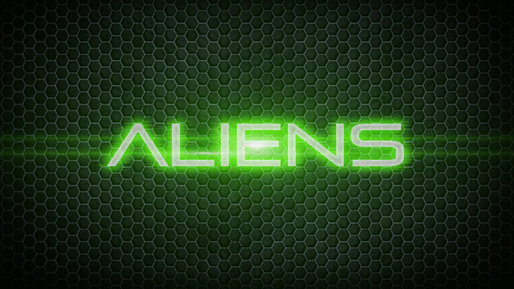

  

# Aliens
- Created in 2012
- Using Blender
- Notes about this written in October 2023
---
After Wombo Hunter, Abomination, and many other short-lived projects, the obsession with Call of Duty Zombies really culminated here. I went all out making a FPS in Blender, that shamelessly tries to be Call of Duty Zombies, just replacing the zombies with little green aliens. All these years later, and I still think this one is actually really cool. You can tell there was a lot of execution happening - sound effects, attempts at gun animations, attempts at easter eggs. I mean, I think this is where my attention to detail looking at existing games really started building. That as well as my confidence in Blender, to possibly replace my home at the time, GameMaker. It's a shame the gunplay wasn't finished, because even if the rest isn't I would enjoy sitting down with this to play it. Unfortunately I must have gotten hooked on something else before getting too far with this.

### Controls
WASD/Mouse typical FPS control, Shift to run (but get ready for awful camera shake)
Left mouse to shoot, Right mouse to zoom
